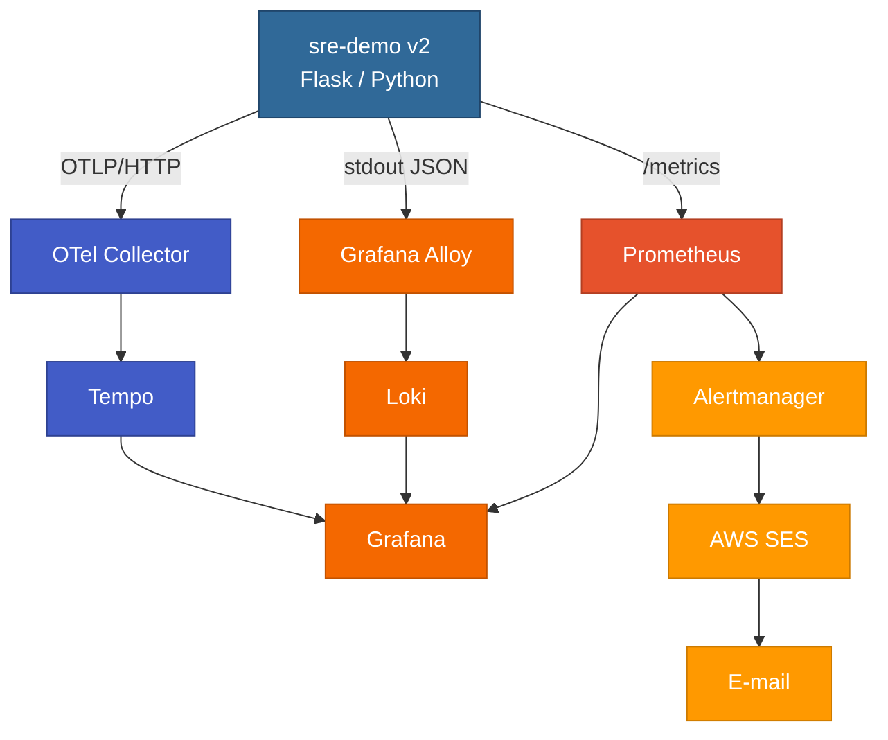
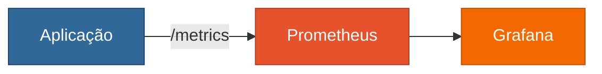
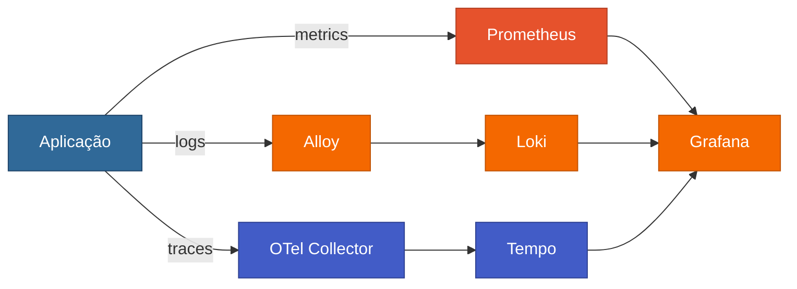

# SRE — Observabilidade

**Curso prático de Site Reliability Engineering e Observability em Kubernetes**

Construa um laboratório do zero, instrumente uma aplicação em duas etapas, 
correlacione Metrics → Traces → Logs e feche o ciclo com alerting e postmortem.

---

> **Objetivo do curso:** construir um laboratório do zero, instrumentar uma aplicação em duas etapas (`v1` e `v2`), criar dashboards, definir SLI/SLO/Error Budget, correlacionar Metrics → Traces → Logs e finalizar com alerting, Incident Response, Runbook e Postmortem.

---

## Filosofia do curso

Este material não é uma lista de comandos para copiar e colar sem entender.

Em cada módulo você encontrará:

1. **Objetivo** — o que estamos construindo.
2. **Teoria** — por que aquilo existe.
3. **Passo a passo** — todos os comandos utilizados.
4. **Validação** — como confirmar que funcionou.
5. **Troubleshooting** — erros reais encontrados durante a construção do laboratório.
6. **Checkpoint** — o que você deve saber antes de avançar.

---

## Arquitetura final

**metrics** → Prometheus  ·  **logs** → Alloy → Loki  ·  **traces** → OTel → Tempo  ·  tudo correlacionado no Grafana

---

## Evolução da aplicação

### App v1 — observabilidade básica

`alanmosilva/sre-demo:v1`

Você aprenderá:

- Counter, Gauge e Histogram;
- PromQL;
- RPS;
- Error Rate;
- Availability;
- p95/p99;
- dashboard básico.

### App v2 — telemetria completa

`alanmosilva/sre-demo:v2`

Além disso:

- logs estruturados JSON;
- `trace_id` e `span_id`;
- OpenTelemetry;
- TraceQL;
- LogQL;
- Exemplars;
- Prometheus → Tempo;
- Loki → Tempo;
- Tempo → Loki;
- dashboard profissional;
- SLO / Error Budget / Burn Rate;
- HPA e saturação;
- alertas via AWS SES;
- Runbook;
- MTTD / MTTA / MTTR;
- Postmortem.

---

## Módulos

| # | Módulo |
|---|---|
| 01 | Fundamentos de SRE, Observability e Telemetria |
| 02 | Preparando o cluster kubeadm |
| 03 | Prometheus e Grafana com persistência |
| 04 | App v1 + Docker Hub |
| 05 | Dashboard básico + PromQL |
| 06 | SLI, SLO, SLA, Error Budget e Burn Rate |
| 07 | Construindo a App v2 |
| 08 | Logs com Loki + Grafana Alloy |
| 09 | Traces com Tempo + OpenTelemetry Collector |
| 10 | Deploy da App v2 e validação da telemetria |
| 11 | Correlação Metrics → Traces → Logs e Exemplars |
| 12 | Dashboard SRE profissional + HPA + saturação |
| 13 | Alerting com PrometheusRule + Alertmanager + AWS SES |
| 14 | Incident Response + Severidade + Runbook |
| 15 | MTTD, MTTA, MTTR + Postmortem + GameDay |
| 16 | Troubleshooting real do laboratório |

---

## Convenções usadas

- Namespace da aplicação: `sre-lab`
- Namespace Prometheus/Grafana: `monitoring`
- Namespace Loki: `loki`
- Namespace Alloy: `alloy`
- Namespace Tempo: `tempo`
- Namespace OTel Collector: `otel`
- Docker Hub: `alanmosilva/sre-demo`
- Kubernetes: `v1.35`
- Pod CIDR: `10.244.0.0/16`
- AWS Region: `sa-east-1`

---

## Ordem recomendada

Execute os módulos em sequência. Não pule diretamente para Loki/Tempo sem antes validar a App v1 e Prometheus.

O objetivo é aprender a evolução da observabilidade, não apenas chegar ao resultado final.
